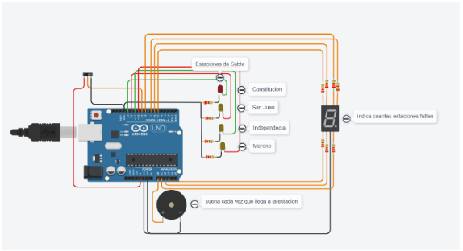

# Ejemplo Documentación 

## Integrantes 
- Facundo Diz 

## Proyecto: Contador binario.

## Descripción
Lo que hace es por cada estacion que pasa el subte, prende la luz correspondiente a cada estacion, en el display muestra cuantas estaciones faltan para la ultima y en cada estacion que pasa suena el buzzer

## Función principal
Esta funcion se encarga de verificar primero si el sistema esta encendido, si esto es asi si el contador es mayor o igual que cero, enciende los leds, el numero en el display, imprime por consola el nombre de la estacion, todo esto depende del contador y hace sonar el buzzer, 

~~~ C (lenguaje en el que esta escrito)
void loop()
{
  if(digitalRead(interruptor)==HIGH)
  {
  	if(contador >= 0)
    {
      encenderLeds(contador);
      encenderNumero(contador);
      imprimirEstacion(contador);
	  encenderBuzzer();
      apagarPines();
      contador--;
    }
  }else
  {
    contador = 3;
  }
  
  delay(tiempo);
}
~~~

## :robot: Link al proyecto
- [proyecto](https://www.tinkercad.com/things/lPXRTVpGBin?sharecode=Qro7eek1NtnL-cCrCO8asUTT1JfMQ-fRlqdigcbRuvY)

---
### Fuentes
- [Consejos para documentar](https://www.sohamkamani.com/how-to-write-good-documentation/#architecture-documentation).

- [Lenguaje Markdown](https://markdown.es/sintaxis-markdown/#linkauto).

- [Markdown Cheatsheet](https://github.com/adam-p/markdown-here/wiki/Markdown-Cheatsheet).

- [Tutorial](https://www.youtube.com/watch?v=oxaH9CFpeEE).

- [Emojis](https://gist.github.com/rxaviers/7360908).

---

